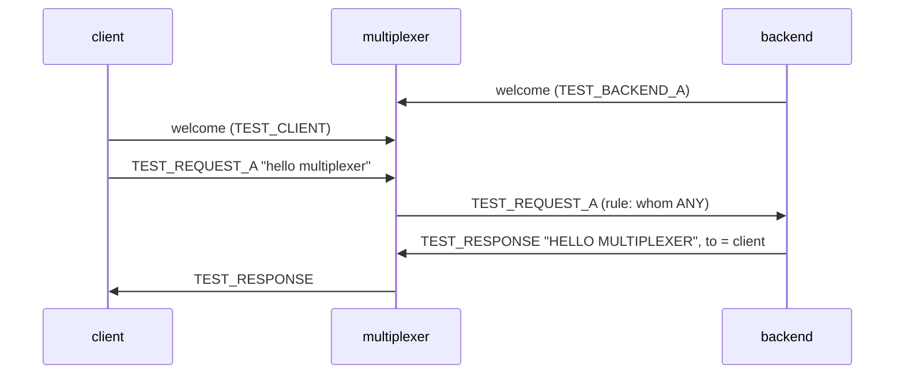

# Query one

One multiplexer, one backend, one client, one query.

## What happens



## What is checked

- One response, of type TEST_RESPONSE, with the upper-cased payload.
- The backend saw exactly one request and exits cleanly on SIGTERM.

## Run

```
bazel test //tests/scenarios:query_one_py_py
```

The two suffixes are the languages of the roles, first the backend's and
then the client's: `_py_py` runs it with both in Python, `_cc_py` with a C++
backend and a Python client, and so on; `bazel query 'tests/scenarios:all'`
lists every combination.

The scenario is [query_one.py](query_one.py); the roles it spawns are described in
[tests/README.md](../../README.md).
