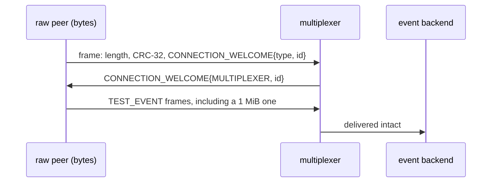

# Raw protocol

A peer speaking the wire format directly, without the client library.

Handshake, framing and CRC, then two TEST_EVENT messages, one with every byte
value and one of 1 MiB, must reach a backend intact.

## What happens



## What is checked

- The handshake works byte by byte as docs/wire_format.md describes.
- Every event, including the 1 MiB one, arrives intact (same size and content).

## Run

```
bazel test //tests/scenarios:raw_protocol_py
```

The peer under test is a raw one, driven by the scenario itself; the
suffix is the language of the event backend that stands by, and only the
Python one is used.

The scenario is [raw_protocol.py](raw_protocol.py); the roles it spawns are described in
[tests/README.md](../../README.md).
