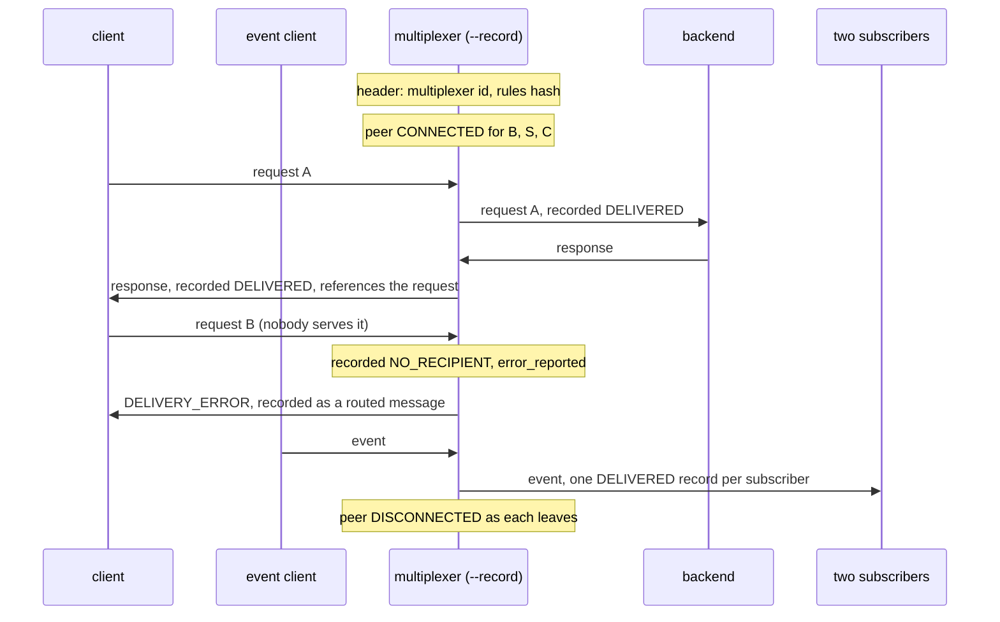

# Recording

The multiplexer records every peer event and delivery attempt, and the recording reads back.

A query with its reply, a broadcast to two backends, a request nobody
serves and a peer connecting and leaving all pass through a multiplexer
started with `--record`. The file is read back with `multiplexer.recording`:
the header names the rules, every record has the fields routing resolved,
and they come in the order things happened.

## What happens



## What is checked

- The header carries the rules file's SHA-1, which equals the one in the generated constants.
- The request and its reply are recorded with sender, recipient and both peer types resolved, the request first.
- A broadcast yields one record per subscriber, with the same message id.
- A request nobody serves is recorded as NO_RECIPIENT for the intended peer type, with the error reported, and the DELIVERY_ERROR sent back appears as a routed message.
- Peers appear as CONNECTED before their traffic and DISCONNECTED after.
- With `--record-payload-bytes 3`, payloads are cut to three bytes and marked truncated.

## Run

```
bazel test //tests/scenarios:recording_py_py
```

The two suffixes are the languages of the roles, first the backend's and
then the client's.
