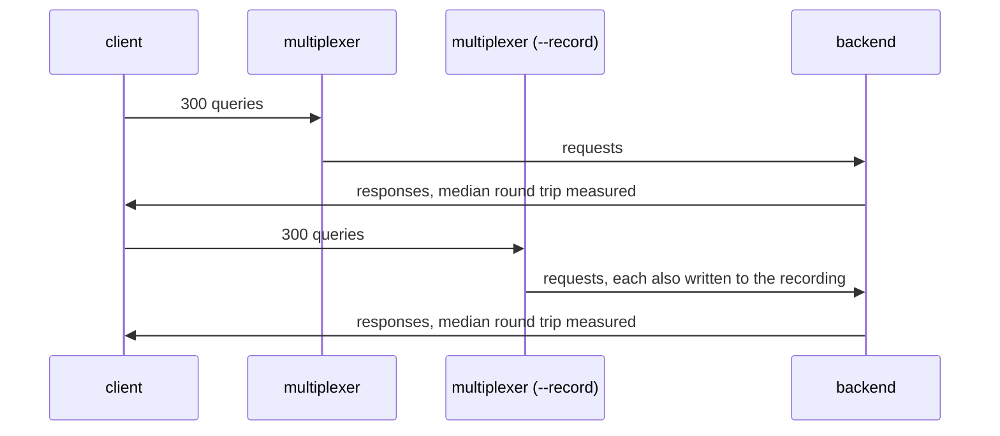

# Recording latency

Recording costs the routed message nothing a client can measure.

The same client runs the same queries against a multiplexer with `--record`
and one without; the median round trip differs by less than half a
millisecond, ten times the cost of the buffered write the recording adds.

## What happens



## What is checked

- Every query is answered in both runs.
- The two medians differ by less than 0.5 ms.

## Run

```
bazel test //tests/scenarios:recording_latency_py_py
```

The two suffixes are the languages of the roles, first the backend's and
then the client's.
