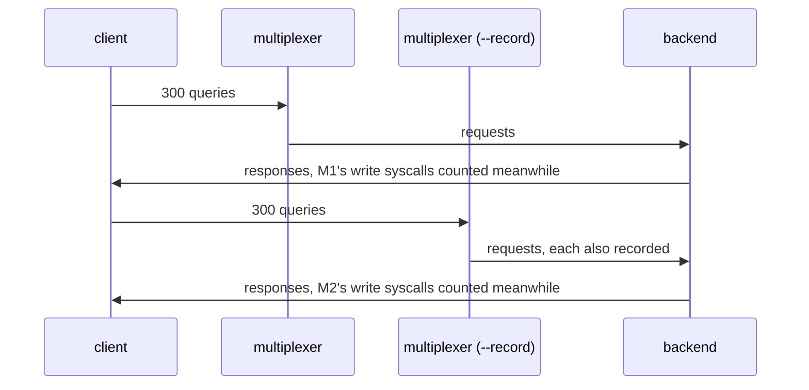

# Recording latency

Recording costs the routed message no write of its own, so nothing a
client could wait for: the multiplexer buffers its records and writes the
file a block at a time, and once a second.

The same client runs the same queries against a multiplexer without
`--record` and one with it. The write syscalls each multiplexer makes over
the queries, counted in `/proc/<pid>/io` (`syscw`), differ by fewer than
one per ten records the recording holds, and the recording holds every
query and its response. Counted, not timed: a write per record would add
one for each, however fast or loaded the machine; sockets are written
with `sendmsg()`, which the count leaves out.

## What happens


```mermaid
sequenceDiagram
    participant C as client
    participant M1 as multiplexer
    participant M2 as multiplexer (--record)
    participant B as backend
    C->>M1: 300 queries
    M1->>B: requests
    B->>C: responses, M1's write syscalls counted meanwhile
    C->>M2: 300 queries
    M2->>B: requests, each also recorded
    B->>C: responses, M2's write syscalls counted meanwhile
```

## What is checked

- Every query is answered in both runs.
- The recording holds every request delivered to the backend and every
  response delivered to the client.
- The multiplexer with `--record` makes fewer than one more write syscall
  per ten records than the one without.

## Run

```
bazel test //tests/scenarios:recording_latency_py_py
```

The two suffixes are the languages of the roles, first the backend's and
then the client's.
