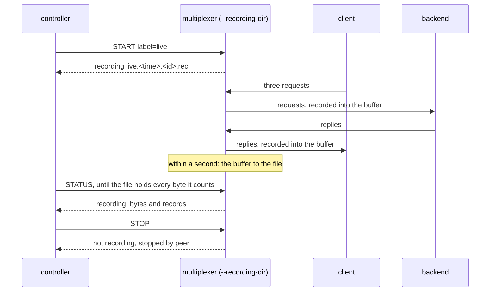

# Recording live file

An open recording session's file holds every record within about a second, while the session goes on.

The multiplexer writes the records through a buffer, written out when it
fills and once a second while the session is open. Three queries pass
through a session, far less than the buffer holds; without the session
closing, the file comes to hold every byte and every record the status
counts, so a reader can follow it live and a multiplexer that dies loses
at most about the last second's records. The buffer used to be written
out only when full or when the session closed.

## What happens



## What is checked

- While the session is open, the file comes to be as long as the bytes the status counts, and holds as many records as it counts, within 60 seconds on a loaded machine; one flush, a second, is what it takes.
- The session stayed far below the stream's buffer, so the buffer filling did not write the file.
- The file starts with the header and holds every request and its reply.
- `stop` closes the session; the file's size is the bytes the status then reports.

## Run

```
bazel test //tests/scenarios:recording_live_file_py_py
```
