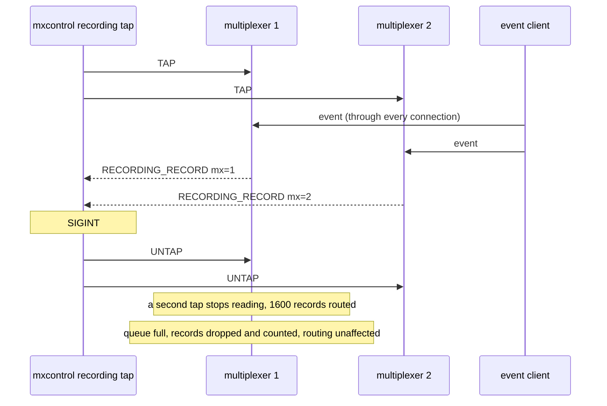

# Recording tap

A peer taps two multiplexers and receives every record live, tagged with the multiplexer that routed it; a slow tap loses records but nothing else.

`mxcontrol recording tap` subscribes on every connection and writes the
records it receives as one stream, each carrying the multiplexer's id;
nothing is written on the multiplexers' side. A tap that stops reading fills
its outgoing queue: the multiplexer drops its records, counts them in the
status, and keeps routing.

## What happens



## What is checked

- Both multiplexers report one tap; an event sent through both connections arrives in the tap's output twice, once per multiplexer id, along with the backend's arrival; the output has no file header and no file appears on the multiplexers' side.
- SIGINT makes the tap untap and exit 0, reporting how many records it wrote.
- A tap that does not read loses records once its queue is full: the status counts the drops, the queries all succeed, and a file session opened beside it has every one of them.

## Run

```
bazel test //tests/scenarios:recording_tap_py_py
```
