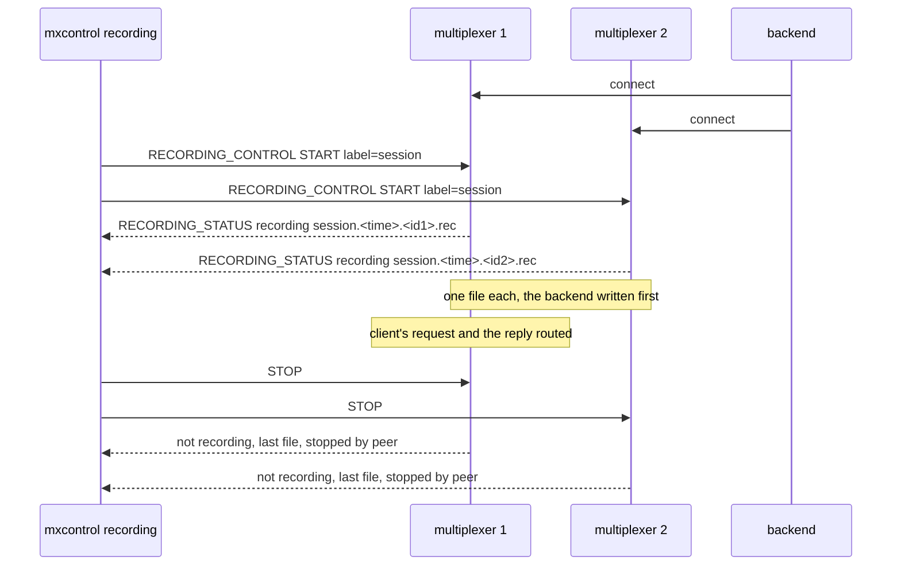

# Remote recording

A recording session is started and stopped on two multiplexers over the protocol, one file each in a shared directory.

Two multiplexers share one recording directory, as replicas on one volume
would. `mxcontrol recording start` reaches both, and each opens a file named
after the label, the time and its own instance id, so the files never
collide; the peers connected at that moment are written first. Traffic is
routed while recording, `status` counts it, `stop` closes both files, and
`read_many` merges them by time into one session. The Python API does the
same from a test.

## What happens



## What is checked

- `status` before shows both idle; `start` answers one line per multiplexer with a path in the shared directory, named after the label and that multiplexer's instance id; the two names differ.
- `status` under traffic counts the records; `stop` reports the path, the counts and who stopped it.
- The two files merged by `read_many` carry both headers with the label, every record tagged with its multiplexer, the connected backend as the first peer event of each file, the request delivered once and its reply after it.
- `mxcontrol dump_recording` over both files prints them merged by time, every line marked with its multiplexer, the headers with the label.
- A second `start` with the same label makes two new files.
- The Python API (`recording.start`, `status`, `stop`) does the same, with `payload_limit` in the header.

## Run

```
bazel test //tests/scenarios:remote_recording_py_py
```
