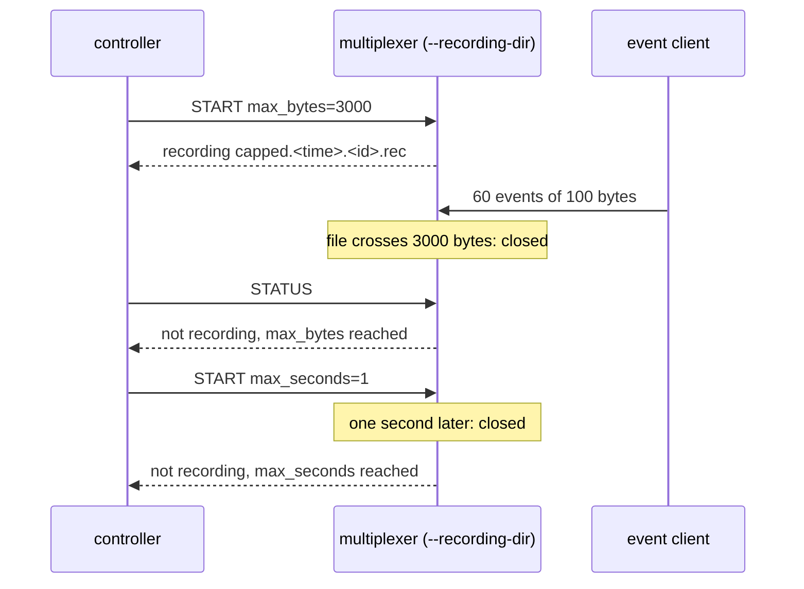

# Remote recording cap

A remote session closes itself at its byte cap or its time cap, and a session started with `--record` can be stopped remotely.

A session started over the protocol has a cap: `max_bytes`, by default one
gibibyte, or `max_seconds`. Reaching either closes the file and the status
says so, so a forgotten session cannot fill a volume. A multiplexer started
with `--record` has a session too, which a controller may stop.

## What happens



## What is checked

- With `max_bytes=3000` the session closes right after the record that crossed the cap; the status says `max_bytes reached`, its byte count is the file's size, its record count matches the file, and a new session may follow.
- With `max_seconds=1` the session closes by itself within a few seconds with `max_seconds reached`.
- A multiplexer started with `--record` reports that session, without a label; a controller stops it and may start another in the directory.

## Run

```
bazel test //tests/scenarios:remote_recording_cap_py
```
