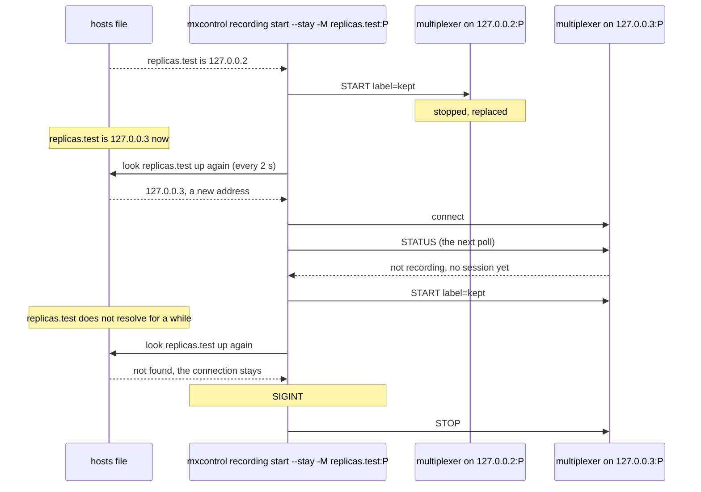

# Remote recording new address

`mxcontrol recording start --stay` and `mxcontrol recording tap` reach a replica that comes back under a new address of the name they were given.

A replica replaced behind a name, a rescheduled pod of a headless service
say, comes back under another address. Both commands look the names up
again at every poll and connect to each address that is new, so --stay
starts its session on the replacement and the tap subscribes there; the
old address stays, retried as any lost connection is, and a name that
stops resolving for a while takes no connection away. The name lives in a
hosts file the scenario rewrites, which the test build of mxcontrol,
tests/fake_dns, reads at every lookup; the replicas listen on 127.0.0.2 and
127.0.0.3, loopback addresses that need no configuration.

## What happens



The tap goes the same way: the replacement answers the status request at
the end of the round in which it was connected with `not tapping`, and gets
a TAP.

## What is checked

- `--stay`: once the name moves to the replacement, it records under the label within a couple of polls. Then the name stops resolving: the command says so, and keeps its connection, through which SIGINT stops the session (stopped by peer); it exits 0, and the recording directory holds the first replica's file and the replacement's. The output names the new address and says the session was started.
- `tap`: once the name moves, the replacement has the tap and its records reach the output, tagged with its instance id; SIGINT untaps it and the command exits 0. The output names the new address.
- Both fail on a build that resolves the names only at start: the replacement is never connected to, and the old address is all the command retries.

## Run

```
bazel test //tests/scenarios:remote_recording_new_address_test
```
