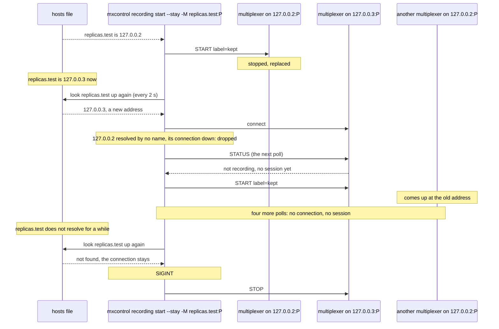

# Remote recording new address

`mxcontrol recording start --stay` and `mxcontrol recording tap` follow a replica to a new address of their name, let the old one go, and start with nothing reachable.

A replica replaced behind a name, a rescheduled pod of a headless service
say, comes back under another address. Both commands look the names up
again at every poll and connect to each address that is new, so --stay
starts its session on the replacement and the tap subscribes there. The
old address, which no name resolves to any more and whose connection is
down, is dropped: a multiplexer that comes up there later, another
deployment's that got the address, never hears from the command, which
would start a session there or mix its records into the tap's. A name
that stops resolving for a while takes no connection away. Started with
nothing reachable, the name not published yet or nothing listening at its
address, both commands wait for the polls to find a replica, --stay
starting its session there though the replica had one of an earlier run,
and end with 0 once stopped. The name lives in a hosts file the scenario rewrites,
which the test build of mxcontrol, tests/fake_dns, reads at every lookup
and counts the lookups in, one a poll; the replicas listen on 127.0.0.2
and 127.0.0.3, loopback addresses that need no configuration.

## What happens



The tap goes the same way: the replacement answers the status request at
the end of the round in which it was connected with `not tapping`, and gets
a TAP; the multiplexer at the old address gets nothing.

Started with nothing reachable, the command says so and polls: the name
not published yet is looked up again every 2 s, and an address where
nothing listens is retried every 3 s, until the replica is there.

## What is checked

- `--stay`: once the name moves to the replacement, it records under the label within a couple of polls. The command drops the old address, and a multiplexer started there afterwards has no controller connected, no session and no tap four polls later, counted by the lookups. Then the name stops resolving: the command says so, and keeps its connection, through which SIGINT stops the session (stopped by peer); it exits 0, and the recording directory holds the first replica's file and the replacement's, none at the old address. The output names the new address and says the session was started.
- `tap`: once the name moves, the replacement has the tap and its records reach the output, tagged with its instance id; the multiplexer started at the old address hears nothing, as above; SIGINT untaps the replacement and the command exits 0. The output names the new address.
- `--stay` started while the name resolves to nothing: the command says no multiplexer is reachable yet and keeps running; once a replica is up, given a session of an earlier run and its stop, and the name says where, it records under the label; SIGINT stops it and the command exits 0.
- `tap` started while nothing listens at the name's address: the same, the replica tapped once it is up, untapped on SIGINT, exit 0.
- The first two fail on a build that resolves the names only at start, whose replacement is never connected to, and on one that keeps retrying the old address, which reaches the multiplexer there and starts a session or a tap on it; the last two on a build that exits 1 with nothing reachable, the third on one that starts a session only on a multiplexer that never had one.

## Run

```
bazel test //tests/scenarios:remote_recording_new_address_test
```
