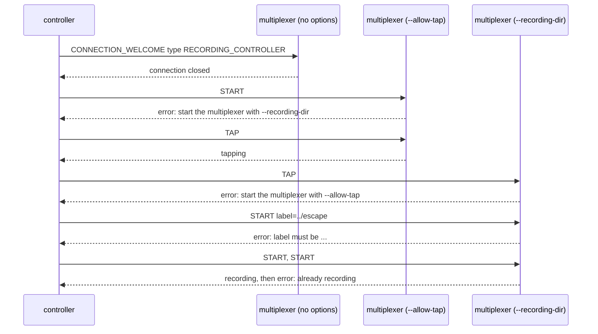

# Remote recording refused

Every way a recording request is refused: the feature off, a bad label, a second session, and a stop with nothing to stop.

A multiplexer started without `--recording-dir` and `--allow-tap` does not
even accept a recording controller's connection. With only one of the two,
the other action is refused with a status that says which option is
missing. A label that could be a path is refused. Starting while a session
is open is refused; stopping or untapping with nothing open is not an
error.

## What happens



## What is checked

- Without either option `mxcontrol recording` reports no multiplexer reachable and the Python controller gets `NotConnected`.
- `--allow-tap` alone refuses START naming `--recording-dir`; `--recording-dir` alone refuses TAP naming `--allow-tap`.
- Empty, path-like, spaced, dotted and over-long labels are refused and no file is opened; a 64-character label is accepted.
- A second START while recording is refused and leaves the session open; STOP and UNTAP when idle are not errors, and the last session stays in the status.

## Run

```
bazel test //tests/scenarios:remote_recording_refused_test
```
