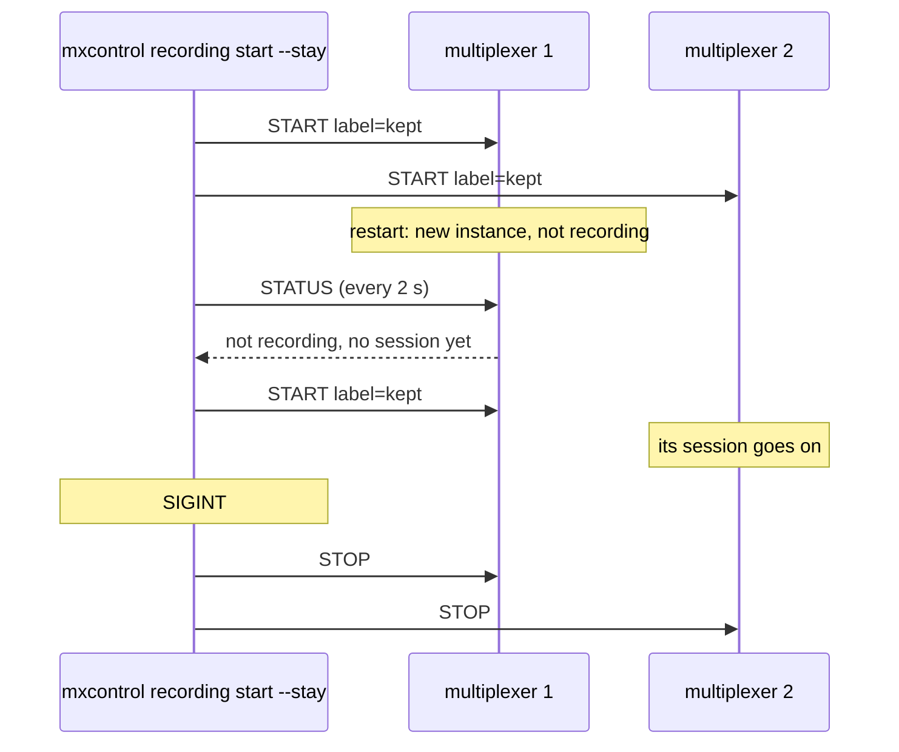

# Remote recording stay

A session kept by `mxcontrol recording start --stay` follows a replica through a restart and ends on SIGINT.

Recording state lives in the multiplexer process, so a replica replaced
mid-session comes back not recording. With `--stay` the command keeps its
connections, asks every multiplexer for its status every couple of seconds,
starts a session on any that has never had one, and stops every session
when it is interrupted.

## What happens



## What is checked

- Both multiplexers record under the label; after one restarts, the new instance records again within the poll interval plus the reconnect delay, into a new file, while the other's session is untouched: three files in all.
- SIGINT stops every session (each status says stopped by peer) and the command exits 0 having printed that it started the replacement's session.

## Run

```
bazel test //tests/scenarios:remote_recording_stay_test
```
