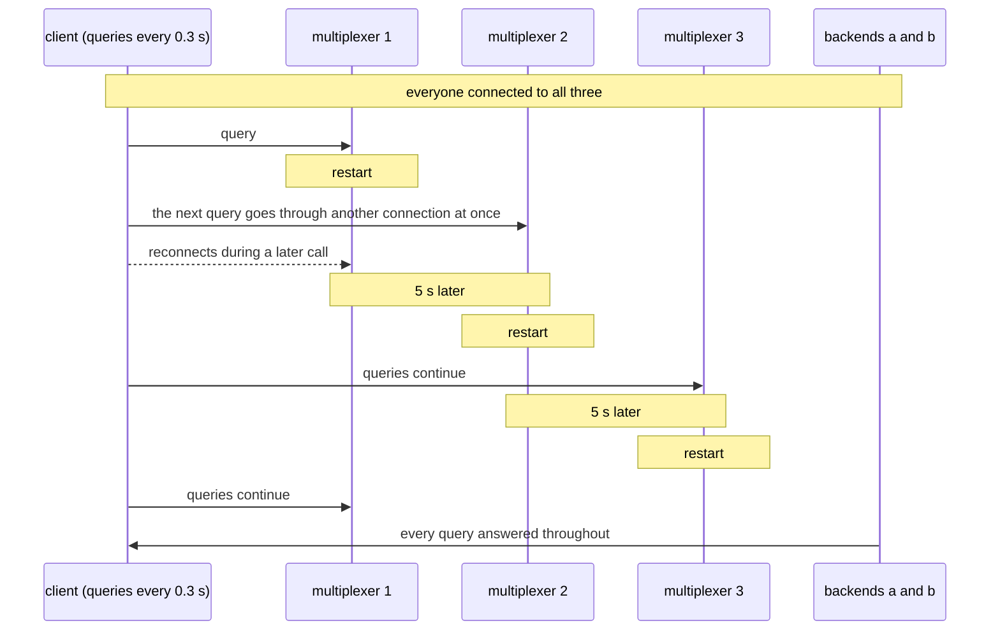

# Rolling restart

Three multiplexers restarted one after another under traffic; nobody notices.

The rolling restart of a datacenter deployment: every peer is connected to
every multiplexer, one multiplexer goes down and comes back, then the next,
then the last, with enough time between them for everyone to reconnect. A
client keeps querying throughout, and a sender keeps sending events.

## What happens



## What is checked

- Every query is answered and none fails, with the synchronous client and with the threaded client keeping three in flight.
- No query took more than 2.5 s: with the other multiplexers up, a dead connection is replaced at once rather than waited for.
- At the end the client is connected to all three again.
- A flushing event sender never fails a send; the events it wrote while the backend had not yet rejoined a freshly restarted multiplexer are dropped by design, at most a few per restart.

## Run

```
bazel test //tests/scenarios:rolling_restart_py_py
```

The two suffixes are the languages of the roles, first the backend's and
then the client's. It is tagged slow.
