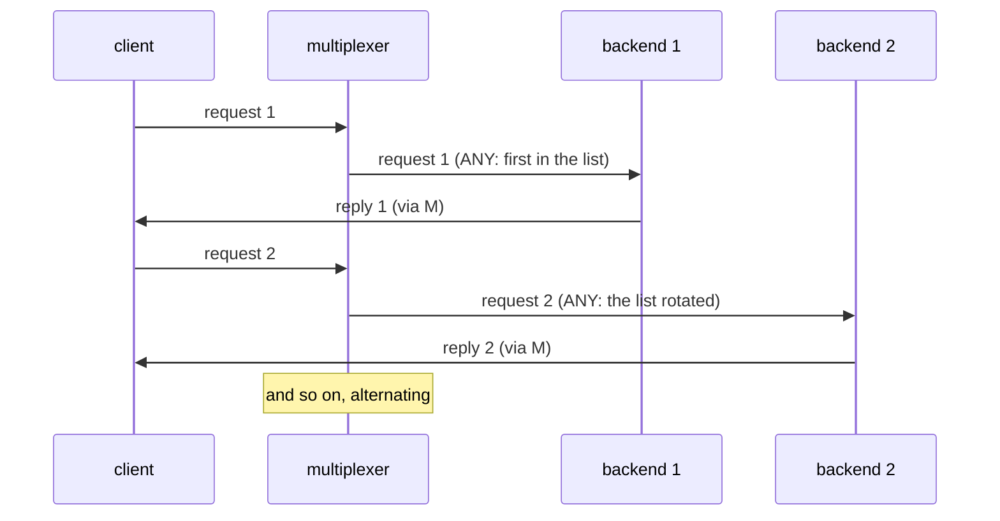

# Round robin

Two backends of one type share the queries of one client.

## What happens



## What is checked

- Every query is answered.
- Each backend handled about half of the requests, so the rule really rotates.

## Run

```
bazel test //tests/scenarios:round_robin_py_py
```

The two suffixes are the languages of the roles, first the backend's and
then the client's: `_py_py` runs it with both in Python, `_cc_py` with a C++
backend and a Python client, and so on; `bazel query 'tests/scenarios:all'`
lists every combination.

The scenario is [round_robin.py](round_robin.py); the roles it spawns are described in
[tests/README.md](../../README.md).
