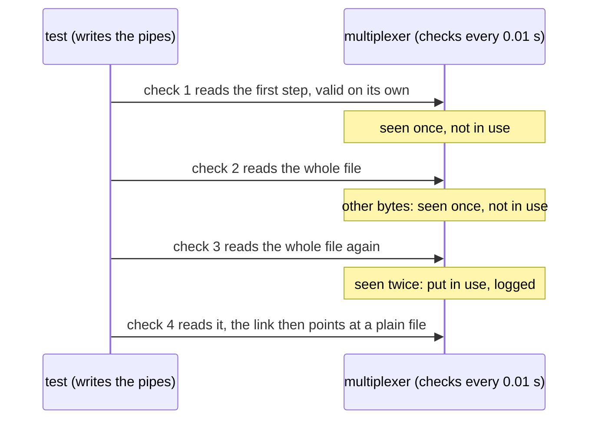

# Rules check reads twice

The periodic rules check puts a change in use only once two checks have read the same bytes: the first step of a file written in two is never applied.

One multiplexer reads its rules file every 0.01 s. The file is a symlink
to a named pipe, a new pipe for every read, so that each check reads what
the test writes next: a check opens the pipe and waits for a writer, the
test's open of it waits for that check, by which the one before is over,
and the link points at the next pipe before this one closes. The file is
written in two steps: the first, the file with one of two new peer types,
valid on its own, is read by one check; the whole file by the next two.
The whole file is put in use at its second read, and the first step
never is, the log says. At the end the link points at a plain file, so
that the checks no longer wait and the multiplexer stops as usual.

## What happens



## What is checked

- Once the check that read the first step is over, the log has no reload to it.
- Once the check that read the whole file once is over, the log has no reload to it either.
- Once the check that read it twice is over, the log has the reload to the whole file, and never one to the first step.

## Run

```
bazel test //tests/scenarios:rules_check_reads_twice_test
```

This scenario spawns no roles, so it has one configuration.

The scenario is [rules_check_reads_twice.py](rules_check_reads_twice.py); the check is described in
[docs/operations.md](../../../docs/operations.md#changing-the-rules).
