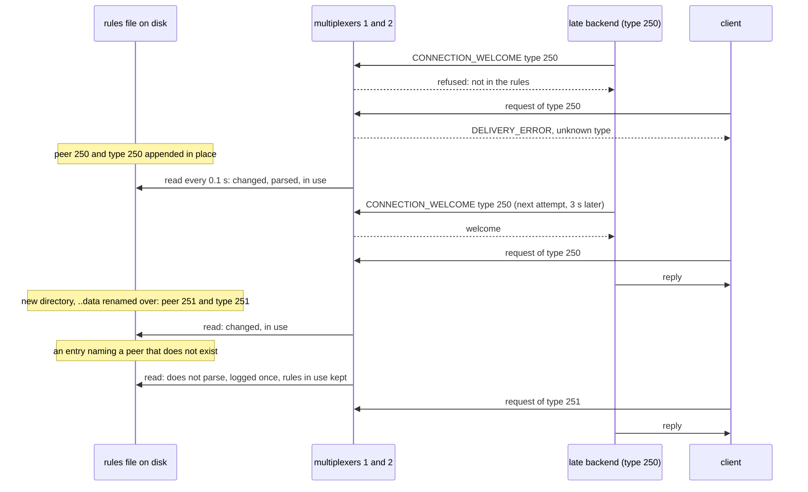

# Rules edited on disk

Types added to the rules file on disk are in use within seconds, without a restart: edited in place, then swapped the way a Kubernetes ConfigMap update is.

Two multiplexers read a copy of the rules file laid out the way the kubelet
mounts a ConfigMap (the file a symlink through a `..data` link to a
timestamped directory), checking it every 0.1 s instead of the default 2 s.
A backend of a type the file does not name is refused, reports zero
connections and keeps trying every 3 s, and a query of a type the file
does not name fails at once. The peer type and a request type routed to it
are appended in place: both multiplexers put the file in use, the backend
is admitted at its next attempt, and the query is answered. Then the file
is replaced the way a ConfigMap update arrives, a new directory and one
atomic rename of the `..data` link, with a second pair of types, and that
is seen too. A file
that does not parse changes nothing, and neither does one caught empty
between a truncate and a write: the last good rules stay in use, the log
says so once, and `mxcontrol rules status` names the error until the file
is fixed. A change is put in use once two checks have read the same new
bytes, so nothing half written is ever applied.

## What happens



## What is checked

- Before the edit every multiplexer logs the refusal of type 250, the backend reports zero connections, and a query of type 250 fails with `OperationFailed` at once.
- After the in-place edit both logs name the new fingerprint, the backend is registered on both multiplexers without being restarted, and the query is answered.
- After the symlink swap both logs name the next fingerprint, a backend of type 251 connects and is asked, and type 250 still works.
- With a broken file both logs say the file was not put in use, with the reason, queries keep being answered, `mxcontrol rules status` reports the last good fingerprint and the error; with the file fixed the status is clean again, and the refusal was logged once, not on every check.
- With the file truncated to nothing both logs say so, queries keep being answered, and the file put back clears the status.

## Run

```
bazel test //tests/scenarios:rules_edited_on_disk_test
```

The scenario is [rules_edited_on_disk.py](rules_edited_on_disk.py); the roles it spawns are described in
[tests/README.md](../../README.md), the reload in [docs/operations.md](../../../docs/operations.md#changing-the-rules).
