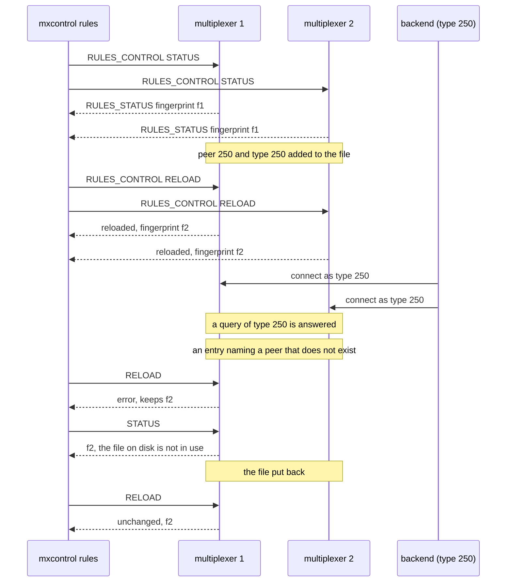

# Rules reload by mxcontrol

`mxcontrol rules reload` puts an edited rules file in use on every multiplexer and reports which rules each runs; a file that does not parse is refused and the rules in use stay.

Two multiplexers run a copy of the rules file with the periodic check off.
`mxcontrol rules status` reports the same fingerprint on both, the one the
generated constants carry. A peer type and a request type are added to the
file: `reload` answers "reloaded" with the new fingerprint from each, a
backend of the new type connects, and a query of the new type is answered.
A recording session open across the reload notes the new fingerprint
where the change happened. An edit naming a peer that does not exist is
refused: `reload` exits 1 with
the reason from each multiplexer, `status` says the file on disk is not in
use, and the query still works. The file put back as it was is "unchanged",
and the status is clean again; a file that is missing is refused the same
way and changes nothing, and the status repeats the reason until a reload
finds the file back; so are an empty file, one without a peer type and
one that repeats a number or a name. An address nobody listens on fails
the command while the reachable multiplexer still answers.

## What happens



## What is checked

- `status` gives one line per multiplexer with the file's fingerprint, the counts and the path; a query of the new type fails before the edit.
- `reload` after the edit answers `reloaded` with the new fingerprint from both; a backend of the new type connects to both and its query is answered.
- A recording session started before the edit and stopped after it holds, on each multiplexer, a `rules` record with the new fingerprint.
- `reload` with a broken file exits 1, each line says why and which rules are kept; `status` says the file on disk is not in use; the query still works.
- `reload` with the file put back answers `unchanged` and the status no longer mentions the file on disk.
- A broken file renamed away and back is said as broken again, not as the read failure between.
- `reload` with the file renamed away exits 1 with `cannot read <path>: No such file or directory`, the query still works, `status` repeats the reason with the periodic check off, and a `reload` with the file put back answers `unchanged` and clears it.
- `reload` with an empty file exits 1 with `empty rules file`, with a file holding no peer type with `no peer types`, with a file repeating a number with `duplicate peer type`, with a peer type of `queue_size: 0` with `queue_size 0 holds no message`, the query still works, and the file put back is `unchanged`.
- `status` with a second address nobody listens on exits 1 and says so on stderr; the reachable multiplexer's line is still printed.

## Run

```
bazel test //tests/scenarios:rules_reload_by_mxcontrol_test
```

The scenario is [rules_reload_by_mxcontrol.py](rules_reload_by_mxcontrol.py); the roles it spawns are described in
[tests/README.md](../../README.md), the command in [docs/mxcontrol.md](../../../docs/mxcontrol.md#rules).
