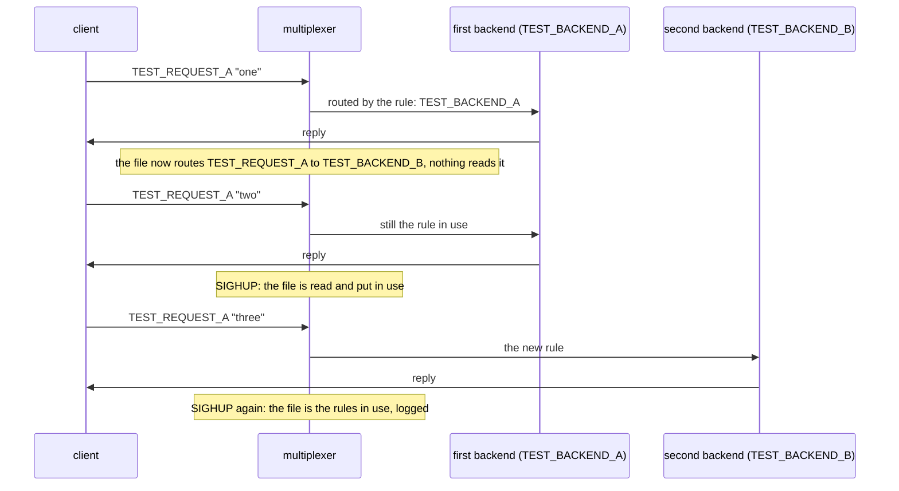

# Rules reload on SIGHUP

SIGHUP makes a multiplexer read its rules file again: a request type rerouted to another backend type takes effect at once, with the periodic check off.

One multiplexer runs a copy of the rules file with `--rules-check-interval
0`, so nothing but a signal or a request reloads it, the way an operator
who wants edits applied on their say-so runs it. Two backends of different
types both serve TEST_REQUEST_A; the file routes it to the first. The rule
is edited to name the second type: queries keep going to the first until
SIGHUP, and to the second from then on. A SIGHUP with the file unchanged is
logged as such, and so is one with a file naming a peer that does not
exist. A peer whose type an edit removed stays connected, counted in the log, and still
gets what is addressed to it, while a new peer of that type is refused.

## What happens



## What is checked

- The first two queries reach the first backend only, the second one after the edit, since the periodic check is off.
- After SIGHUP the log says the rules were reloaded and the third query reaches the second backend only.
- A second SIGHUP with the file unchanged logs that the file is the rules in use; a SIGHUP right after the port file appears is handled, not fatal.
- A SIGHUP with a file naming a peer that does not exist logs the refusal.
- With the first backend's peer type removed from the file, the log counts it as kept, it is still in the peers file, an event addressed to it arrives, and a fresh backend of that type reports zero connections and is refused.
- A SIGHUP with a directory in the file's place logs that it cannot be read, and why; with the file back, the next SIGHUP puts it in use.

## Run

```
bazel test //tests/scenarios:rules_reload_on_sighup_test
```

The scenario is [rules_reload_on_sighup.py](rules_reload_on_sighup.py); the roles it spawns are described in
[tests/README.md](../../README.md), the reload in [docs/operations.md](../../../docs/operations.md#changing-the-rules).
