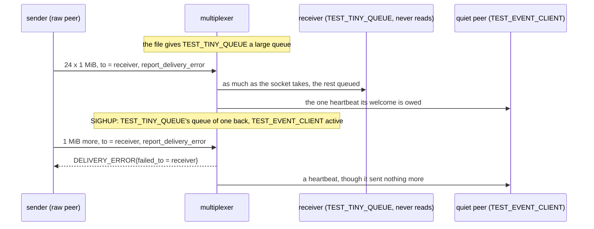
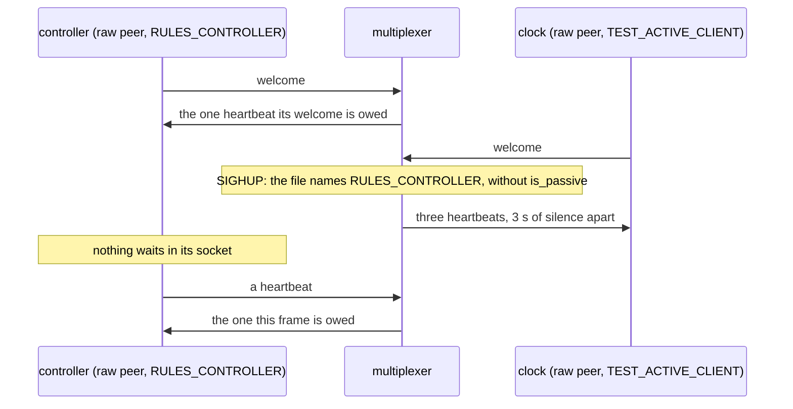

# Rules reload peers

A rules reload gives the peers already connected their type's new queue size and passive flag, a controller staying passive.

One multiplexer runs a copy of the rules file with `--rules-check-interval
0`, so that only SIGHUP reloads it. The copy gives TEST_TINY_QUEUE a large
queue: a receiver of that type that never reads takes what is addressed to
it past what its socket holds. The reload puts the type's queue of one
back, and the next message addressed to the receiver draws a
DELIVERY_ERROR naming it, as in direct_queue_full, where the large queue
took it. The reload also makes TEST_EVENT_CLIENT, a passive type, active:
a passive peer is sent one heartbeat per frame it sends, so one that sent
only its welcome gets one; once active, it gets them though it sends
nothing more.

A controller is passive whatever the file says, when it registers and at
every reload. The second test reloads a file that names RULES_CONTROLLER,
peer type 4, without is_passive, while a raw controller is connected. A
raw peer of the active type TEST_ACTIVE_CLIENT is the clock: it is sent a
heartbeat every 3 s of silence, so three of them after the reload put 6 s
behind it, by when the controller, had the reload made it active, would
have been sent one 3 s after the reload. It has been sent nothing, and a
frame it sends draws the one heartbeat it is owed. Counted, not timed:
every wait is for a message, and its bound only detects a failure.

## What happens



The controller's test:



## What is checked

- After the reload, a message addressed to the receiver draws a DELIVERY_ERROR naming it: the connected receiver took its type's new queue size.
- After the reload, the quiet peer is sent a heartbeat it is not owed as a passive peer: it took its type's new passive flag.
- A controller stays passive through a reload of a file that names its type without is_passive: 6 s after the reload, by the clock's heartbeats, it has been sent nothing, and a frame it sends draws the one heartbeat it is owed.

## Run

```
bazel test //tests/scenarios:rules_reload_peers_test
```

This scenario spawns no roles, so it has one configuration.

The scenario is [rules_reload_peers.py](rules_reload_peers.py); the reload is described in
[docs/operations.md](../../../docs/operations.md#changing-the-rules).
