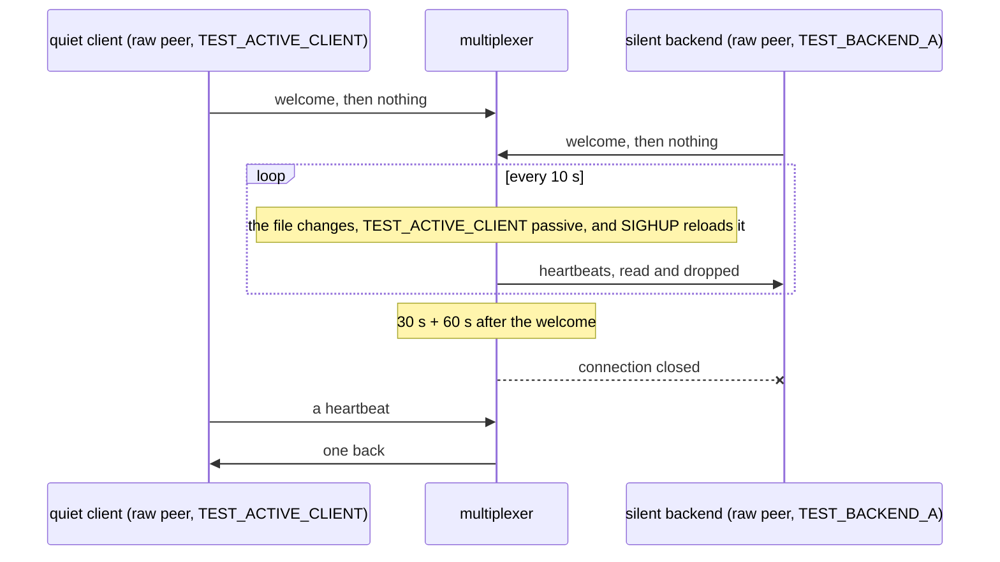

# Rules reload silent backend

A silent backend is dropped on time while rules reloads keep coming, and a client a reload made passive is not.

The multiplexer drops an active peer that sent nothing for 30 + 60 s. A
reload applies the file's passive flags to the peers connected: a flag
set again unchanged must not start that count over, or reloads less than
90 s apart would keep a hung backend connected for good, and a flag
turned on ends it. One multiplexer runs a copy of the rules file with
`--rules-check-interval 0`; a raw peer of the client type
TEST_ACTIVE_CLIENT and then one of the backend type TEST_BACKEND_A say
their welcomes and nothing more. Every 10 s the file, with
TEST_ACTIVE_CLIENT made passive, gets a new comment and SIGHUP reloads
it, and the backend is closed before the fifteenth reload. The client,
connected first, would have been closed first; it is still connected,
and sent a heartbeat for one it sends. Slow: it really waits out the
drop.

## What happens



## What is checked

- The silent backend's connection is closed before the fifteenth reload, 10 s apart: reloads do not start its drop over.
- The quiet client, whose type the first reload made passive, is still connected then, though silent longer, and is sent a heartbeat for one it sends.
- Slow: it really waits.

## Run

```
bazel test //tests/scenarios:rules_reload_silent_backend_test
```

This scenario spawns no roles, so it has one configuration.

The scenario is [rules_reload_silent_backend.py](rules_reload_silent_backend.py); the reload is described in
[docs/operations.md](../../../docs/operations.md#changing-the-rules).
