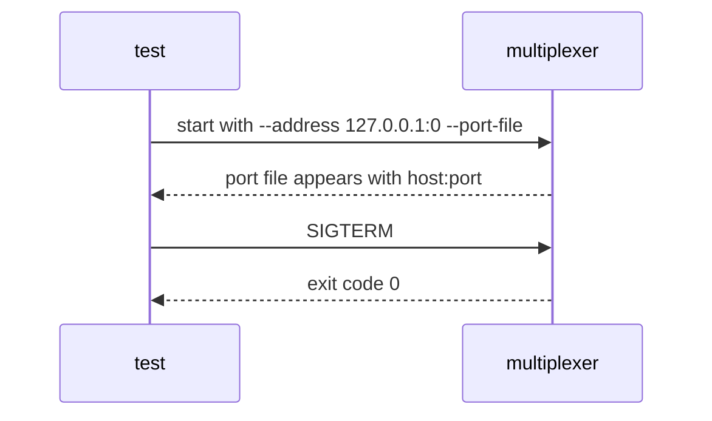

# Server lifecycle

The server reports the port it bound and exits cleanly on SIGTERM.

## What happens



## What is checked

- The port file names a port the test can connect to.
- SIGTERM makes the multiplexer exit with 0, not a crash.

## Run

```
bazel test //tests/scenarios:server_lifecycle_test
```

This scenario spawns no roles, so it has one configuration.

The scenario is [server_lifecycle.py](server_lifecycle.py); the roles it spawns are described in
[tests/README.md](../../README.md).
