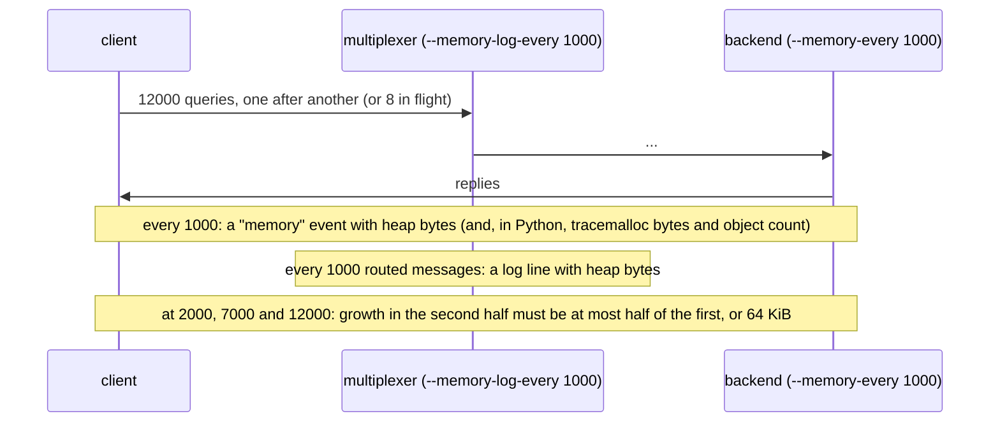

# Soak memory

Thousands of queries do not make the multiplexer, the backend or the client grow.

Exact numbers, not resident size: each process reports the bytes it has
allocated from the C heap (glibc's own count, `mx::heap_in_use_bytes`), the
Python roles also what the interpreter has allocated (`tracemalloc`) and how
many objects exist, and the multiplexer logs its heap after every so many
routed messages. A leak per message shows as growth in the second half of
the run comparable to the first; caches and buffers plateau after the first
stretch.

## What happens



## What is checked

- Every query is answered.
- The C heap in use of the client, the backend and the multiplexer plateaus; for Python roles so do the interpreter's allocations and its object count. A per-message leak in either language, including a reference leak in the binding, fails here with the three numbers in the message.
- `check.sh --leaks` runs the same scenario under LeakSanitizer, which reports what a C++ process still holds when it exits.

## Run

```
bazel test //tests/scenarios:soak_memory_py_py
```

The two suffixes are the languages of the roles, first the backend's and
then the client's; `bazel query 'tests/scenarios:all'` lists every
combination. It is tagged slow.
