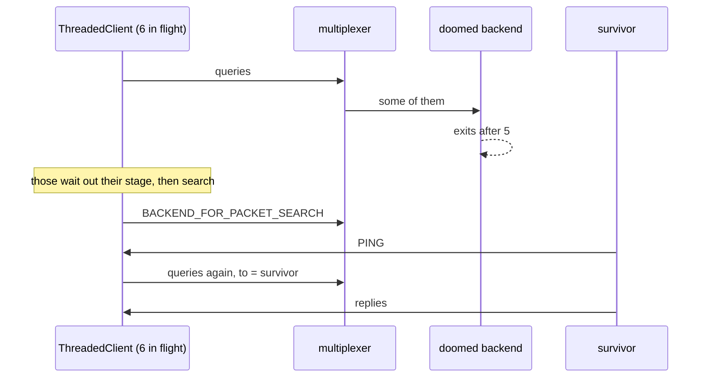

# Threaded backend dies

A ThreadedClient with many queries in flight when one of two backends crashes.

Every query is answered, by the survivor after the crash; the ones that were
inside the dead backend are found again through the search.

## What happens



## What is checked

- All 40 queries are answered with no error; the survivor takes over the ones the doomed backend held.

## Run

```
bazel test //tests/scenarios:threaded_backend_dies_py
```

The suffix is the client's language: `_py` a Python client, `_cc` a C++
one; the backend is the Python one.

The scenario is [threaded_backend_dies.py](threaded_backend_dies.py); the roles it spawns are described in
[tests/README.md](../../README.md).
