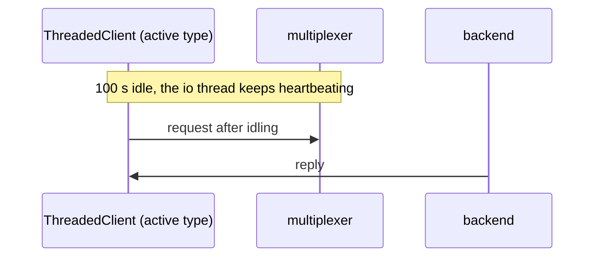

# Threaded idle

A ThreadedClient of an active peer type idles past the drop intervals and still works.

Its io thread answers heartbeats while the program does nothing, which is
what lets the peer type be non-passive. Slow: waits out 30 s + 60 s and more.

## What happens



## What is checked

- The connection is never dropped although the peer type is not passive, and the query after idling works.
- Slow: it really waits.

## Run

```
bazel test //tests/scenarios:threaded_idle_py
```

The suffix is the client's language: `_py` a Python client, `_cc` a C++
one; the backend is the Python one.

The scenario is [threaded_idle.py](threaded_idle.py); the roles it spawns are described in
[tests/README.md](../../README.md).
