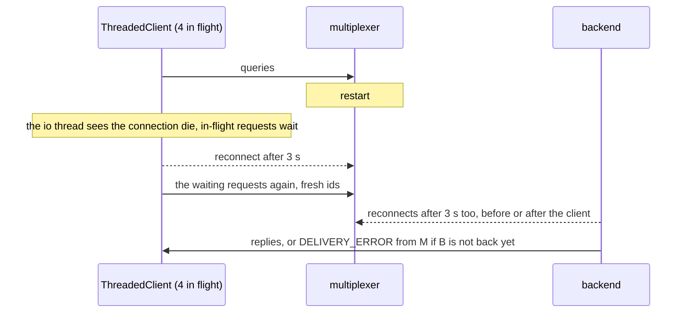

# Threaded mx restarts

A multiplexer restarts with a ThreadedClient's queries in flight: what survives.

With one multiplexer, the only promise is that nothing hangs. The client
and the backend both reconnect 3 s after the drop, in no fixed order. A
query caught by the restart is sent again once the client is reconnected,
and is answered if the backend is back by then, or fails at once with
`OperationFailed` if the client got there first: a multiplexer with nobody
of the type reports a delivery error, and the search that follows asks the
same one multiplexer. With two multiplexers the queries in flight on the
dead connection go through the live one at once, and none fails or waits.

## What happens



## What is checked

- One multiplexer, either order: all 40 queries resolve, by a reply or by
  an `OperationFailed` at once, none by a timeout; the last eight, issued
  well after the reconnect, are all answered; the connection is back.
- One multiplexer, the backend first: the client process is paused with
  SIGSTOP across the restart and resumed once the backend is registered
  again, so every query is answered and none fails.
- One of two multiplexers: every query is answered, none fails, and none
  waited for the reconnect: the other connection served it; the client is
  back on both at the end.

## Run

```
bazel test //tests/scenarios:threaded_mx_restarts_py
```

The suffix is the client's language: `_py` a Python client, `_cc` a C++
one; the backend is the Python one.

The scenario is [threaded_mx_restarts.py](threaded_mx_restarts.py); the roles it spawns are described in
[tests/README.md](../../README.md).
