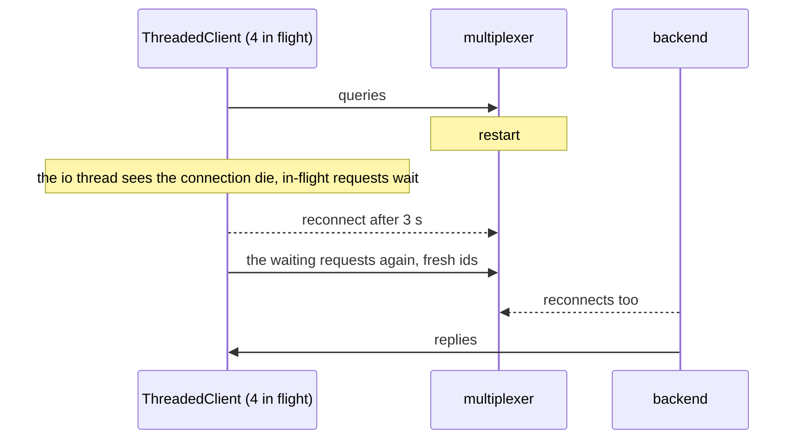

# Threaded mx restarts

The multiplexer restarts with a ThreadedClient's queries in flight; all are answered.

Queries whose request was on the wire when the connection died are sent
again as soon as the client is reconnected, without waiting for a timeout;
the backend reconnects on its own as well.

## What happens



## What is checked

- All 40 queries are answered, none fails, and none took anywhere near its timeout.
- The connection count is back to 1 at the end.

## Run

```
bazel test //tests/scenarios:threaded_mx_restarts_py
```

The suffix is the client's language: `_py` a Python client, `_cc` a C++
one; the backend is the Python one.

The scenario is [threaded_mx_restarts.py](threaded_mx_restarts.py); the roles it spawns are described in
[tests/README.md](../../README.md).
