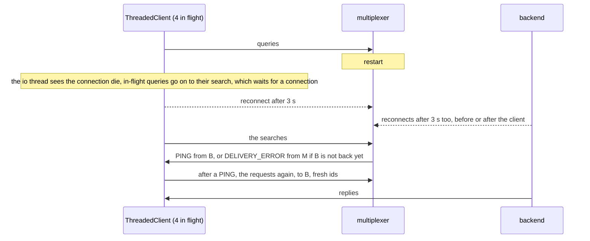

# Threaded mx restarts

A multiplexer restarts with a ThreadedClient's queries in flight: what survives.

With one multiplexer, the only promise is that nothing hangs. The client
and the backend both reconnect 3 s after the drop, in no fixed order. A
query caught by the restart goes on to its search, which goes out once
the client is reconnected, and is answered if the backend is back by
then: the search finds it, and the request goes to it again. If the
client got there first, a multiplexer with nobody of the type reports a
delivery error, the search finds nobody, and the query waits out the
search's timeout for a late reply, which comes only if the backend had
the request before the drop, and raises `OperationTimedOut` without it. A query
that starts while the client is away waits for the reconnect and sends
then, and fails at once with `OperationFailed` if the backend is not back,
since the search that follows asks the same one multiplexer. With two
multiplexers the queries in flight on the dead connection search through
the live one at once, and none fails or waits for the reconnect.

## What happens


```mermaid
sequenceDiagram
    participant C as ThreadedClient (4 in flight)
    participant M as multiplexer
    participant B as backend
    C->>M: queries
    Note over M: restart
    Note over C: the io thread sees the connection die, in-flight queries go on to their search, which waits for a connection
    C-->>M: reconnect after 3 s
    B-->>M: reconnects after 3 s too, before or after the client
    C->>M: the searches
    M->>C: PING from B, or DELIVERY_ERROR from M if B is not back yet
    C->>M: after a PING, the requests again, to B, fresh ids
    B->>C: replies
```

## What is checked

- One multiplexer, either order: all 40 queries resolve, by a reply, by
  an `OperationFailed` at once, or, for a query in flight whose search
  the multiplexer answered before the backend was back, by
  `OperationTimedOut` once that search timed out; the last eight, issued
  well after the reconnect, are all answered; the connection is back.
- One multiplexer, the backend first: the client process is paused with
  SIGSTOP across the restart and resumed once the backend is registered
  again, so every query is answered and none fails.
- One of two multiplexers: every query is answered, none fails, and none
  waited for the reconnect: the other connection served it; the client is
  back on both at the end.

## Run

```
bazel test //tests/scenarios:threaded_mx_restarts_py
```

The suffix is the client's language: `_py` a Python client, `_cc` a C++
one; the backend is the Python one.

The scenario is [threaded_mx_restarts.py](threaded_mx_restarts.py); the roles it spawns are described in
[tests/README.md](../../README.md).
