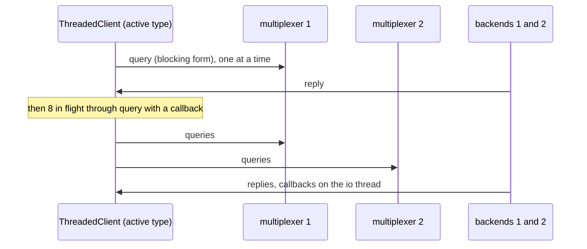

# Threaded queries

A ThreadedClient answers queries one at a time and many at once, on the full mesh.

The client keeps an io thread of its own, so its peer type need not be
passive; here it uses the active TEST_ACTIVE_CLIENT type.

## What happens



## What is checked

- All 30 queries answered in both modes, on the full mesh.
- The client uses an active peer type: no `is_passive` needed.

## Run

```
bazel test //tests/scenarios:threaded_queries_py_py
```

The two suffixes are the languages of the roles, first the backend's and
then the client's: `_py_py` runs it with both in Python, `_cc_py` with a C++
backend and a Python client, and so on; `bazel query 'tests/scenarios:all'`
lists every combination.

The scenario is [threaded_queries.py](threaded_queries.py); the roles it spawns are described in
[tests/README.md](../../README.md).
