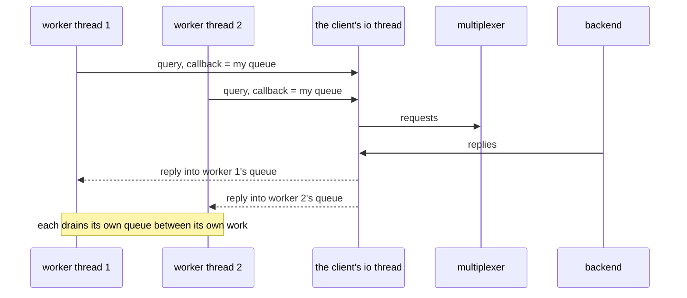

# Threaded workers

Worker threads share one ThreadedClient; each gets its replies through its own queue.

Every thread issues queries with query with a callback, keeps working meanwhile, and
takes the replies from its own queue, which the client's io thread fills.
No thread blocks on the network and none is involved in another's replies.

## What happens



## What is checked

- One client (one instance id) serves 4 worker threads.
- Each worker got exactly its own 10 replies through its own queue.

## Run

```
bazel test //tests/scenarios:threaded_workers_py_py
```

The two suffixes are the languages of the roles, first the backend's and
then the client's: `_py_py` runs it with both in Python, `_cc_py` with a C++
backend and a Python client, and so on; `bazel query 'tests/scenarios:all'`
lists every combination.

The scenario is [threaded_workers.py](threaded_workers.py); the roles it spawns are described in
[tests/README.md](../../README.md).
