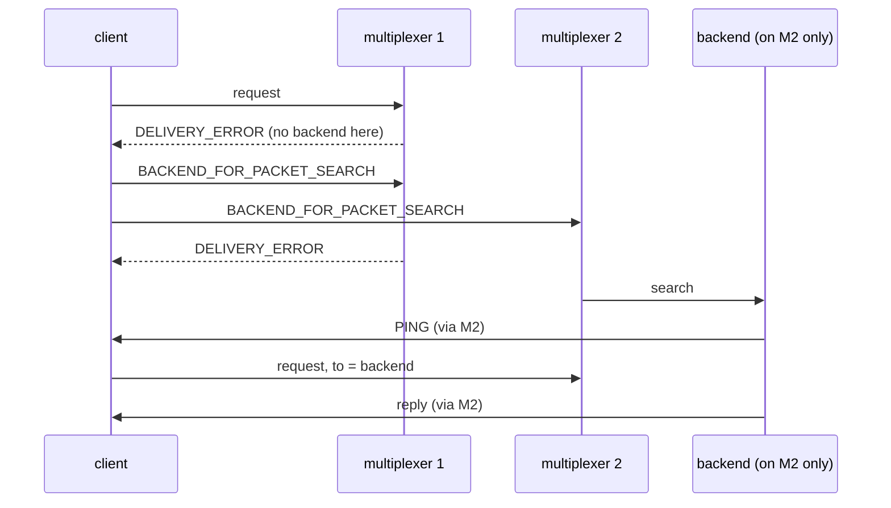

# Two mx backend on one

Two multiplexers, the backend behind only one; the client finds it.

## What happens



## What is checked

- Every query is answered although the first multiplexer has no backend: the search finds it behind the other one.

## Run

```
bazel test //tests/scenarios:two_mx_backend_on_one_py_py
```

The two suffixes are the languages of the roles, first the backend's and
then the client's: `_py_py` runs it with both in Python, `_cc_py` with a C++
backend and a Python client, and so on; `bazel query 'tests/scenarios:all'`
lists every combination.

The scenario is [two_mx_backend_on_one.py](two_mx_backend_on_one.py); the roles it spawns are described in
[tests/README.md](../../README.md).
