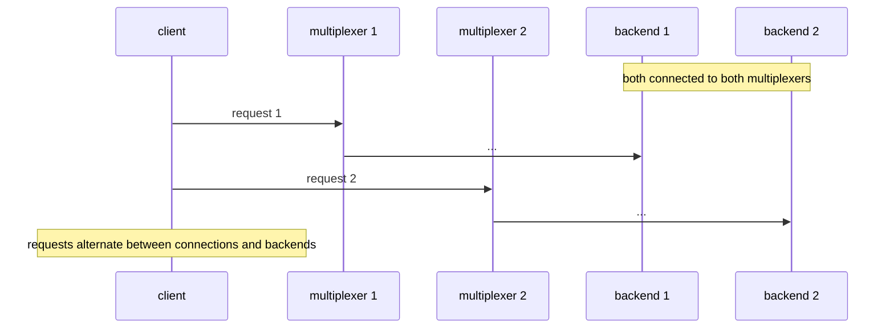

# Two mx backends on each

Two multiplexers with a backend behind each; a client on both.

## What happens



## What is checked

- Every query is answered on the full mesh, and both backends and both connections carried work.

## Run

```
bazel test //tests/scenarios:two_mx_backends_on_each_py
```

The suffix is the client's language: `_py` a Python client, `_cc` a C++
one; the backend is the Python one.

The scenario is [two_mx_backends_on_each.py](two_mx_backends_on_each.py); the roles it spawns are described in
[tests/README.md](../../README.md).
