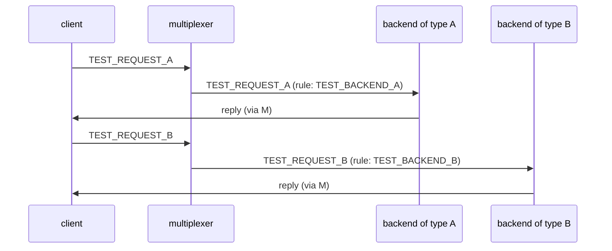

# Two request types

Two request types are routed to their own backend types.

## What happens



## What is checked

- Requests of each type reach only the backend type the rule names.
- Both replies carry the payload as that backend transforms it (upper for A, echo for B).

## Run

```
bazel test //tests/scenarios:two_request_types_py_py_py
```

The three suffixes are the languages of the roles in the order the BUILD
file lists them (the two backends, then the client); `bazel query
'tests/scenarios:all'` lists every combination.

The scenario is [two_request_types.py](two_request_types.py); the roles it spawns are described in
[tests/README.md](../../README.md).
