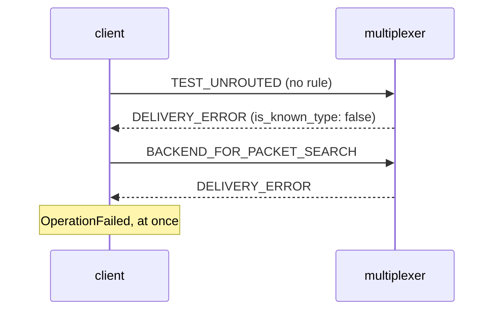

# Unrouted type

A query of a type with no routing rule fails at once, not after a timeout.

The multiplexer answers a message whose type has no rule (and no `to`)
with DELIVERY_ERROR right away; query() then searches for a backend, every
multiplexer says no, and the call raises OperationFailed within milliseconds.

## What happens



## What is checked

- The query fails quickly with OperationFailed rather than hanging for its timeout.

## Run

```
bazel test //tests/scenarios:unrouted_type_py
```

The suffix is the client's language: `_py` a Python client, `_cc` a C++
one; the backend is the Python one.

The scenario is [unrouted_type.py](unrouted_type.py); the roles it spawns are described in
[tests/README.md](../../README.md).
